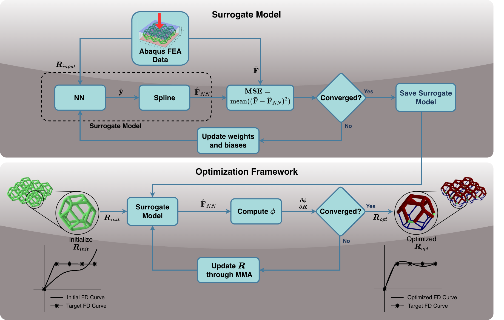

# A Novel Surrogate Model for Optimizing Lattice for Desired Force-Displacement Response

**Akshay Kumar**, **Saketh Sridhara**, **Krishnan Suresh**

Department of Mechanical Engineering, University of Wisconsin–Madison

---

## Graphical Abstract





## Quick Start

1. Install dependencies:

```bash
pip install -r requirements.txt
```

2. Generate geometry and input data (example):

Open and run the cells in `frameOptimize.ipynb` to create the input sets.

3. Run Abaqus (to generate FD data):

Edit `run_abaqus.py` parameters then run:

```bash
abaqus cae noGUI=run_abaqus.py
```

4. Train surrogate model:

Open `surrogateBuild.ipynb` and execute the cells to load Abaqus output, train the surrogate(s), and save the trained model to the relevant folder (e.g., `C4NN2var/SurrogateModel.pth`).

5. Optimize with the surrogate:

Run `frameOptimize.ipynb` which loads a saved surrogate, runs multiple optimization starts, and saves results for Abaqus validation.

## Notebooks and Scripts

- `surrogateBuild.ipynb` — build and evaluate surrogate models (NN, GPR, RBF), plotting and comparison routines.
- `frameOptimize.ipynb` — example optimization workflow using a trained surrogate and post-processing/plotting helpers.

- `run_abaqus.py` — wrapper to run Abaqus analyses for generated designs.

## Key Implementation Notes

- Surrogates are trained to predict full FD curves; masked targets allow handling of partial/incomplete FD results.
- Neural network training code and plotting helpers are in `src/utilFuncs.py` and `SurrogateBuild.ipynb`.
- GPR and RBF wrappers are available in `src/GPR.py` and `src/RBF.py`.

## Examples

Run the provided example notebooks (recommended) to reproduce figures and optimization runs. The notebooks include visualization utilities that produce publication-ready PNG outputs (transparent background, controlled aspect ratios).

## Citation

If you use this code for research, please cite the associated paper.

## License

This repository currently has no license and is intended for research use. Contact the authors for collaboration or reuse permissions.

## Acknowledgments

This work was supported in part by the U.S. Office of Naval Research (PANTHER award N00014-21-1-2916).

---
